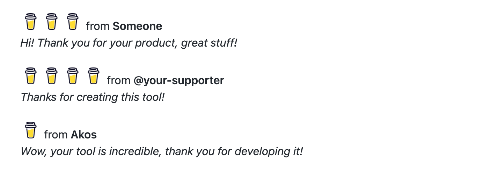

# Buy Me A Coffee Donations and Messages on your Readme page


## It will look like this:



## Prerequisites

In order to set this action, you need to have the followings:
1. A Buy-Me-A-Coffee token
2. A github token (it will be generated automatically)

## Setup

1. Edit your README.md file and add two lines as follows: 
```md
<!--START_SECTION:buy-me-a-coffee-->
<!--END_SECTION:buy-me-a-coffe-->
```

These lines won't be shown in the generated Readme file (because they are comments in HTML), but they will specify the concrete place where the list of the latest donations should be inserted. Please note that anything between these two lines will be removed by the newly generated list when the action is triggered.

2. Create a Token in [Buy Me A Coffee developer page](https://developers.buymeacoffee.com/dashboard)
2.1 Login to the Developers page
2.2 Click to create new Token
2.3 Name your token and click to Create
2.4 Copy the code generated (your token) to the clipboard

3. Set the Buy Me A Coffee Token as a github Secret
3.1 Navigate to the repository in where you would like to use this action
3.2 Go to Settings and then click to Secrets/Actions at the left menu
3.3 Click to 'New repository Secret' button
3.4 Name the secret exactly `BUY_ME_A_COFFEE_TOKEN`
3.5 Paste your Buy Me A Coffee Token from your clipboard and then Save. You should see something like this: 
  
4. Set a workflow in your repository by following the next steps:

1. Go to your project's `actions`, hit `New workflow` and `set up a workflow yourself`, then delete all the default content.
2. Copy-Paste the code below to your new workflow file and save/commit it as `buy-me-a-coffee.yml`.

   ```yml
   name: Buy Me A Coffee Readme

   on:
     workflow_dispatch:
     schedule:
       # Runs at every 12AM UTC
       - cron: "0 0 * * *"

   jobs:
     bmac-readme:
       name: Update Buy Me A Coffee section in this repo's README
       runs-on: ubuntu-latest
       steps:
         - uses: akosbalasko/coffee-readme@main
           with:
             BUY_ME_A_COFFEE_TOKEN: ${{ secrets.BUY_ME_A_COFFEE_TOKEN }}
             GH_TOKEN: ${{secrets.GITHUB_TOKEN }}
   ```

    Optionally you can set `NUMBER_OF_MESSAGES` property as a number of the latest messages to be passed into the readme file. By default it is 3.


## Enjoy! 

PS.: Like what you see? Consider to <a href="https://www.buymeacoffee.com/akosbalasko" target="_blank"></a>! :)  
